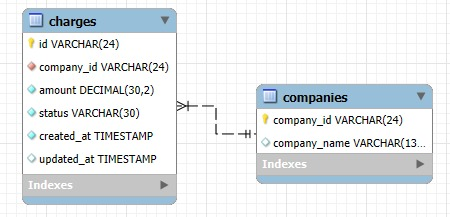

# Data Pipeline | ETL
## Descripción

Este proyecto implementa un pipeline de datos básico para cargar, extraer y transformar un dataset de compras, utilizando PostgreSQL como base de datos principal. Además, incluye una aplicación desarrollada en Scala que contiene los primeros 100 números; al ingresar un número, la aplicación identifica cuál fue el número extraído.

---

## Requisitos

- Docker y Docker Compose instalados
- Python 3.8+ instalado
- Paquetes Python: `psycopg2-binary`, `pandas`
- Instalar dependencias Python: `pip install psycopg2-binary pandas`

---

## Paso 1: Configuración de la base de datos PostgreSQL 1.1

1. Levantar un contenedor Docker con PostgreSQL usando el archivo `docker-compose.yml`:

- bash `docker compose up -d`

---

### Paso 2: Cargar los datos 1.1

- bash `pyhon load_data.py`

- Ejecutar el scrip `load_data.py` para:
- Leer `dataset.csv`
- Limpiar datos nulos o incorrectos
- Insertar la información en la tabla `raw_data`

### ¿Por qué PostgreSLQ? 1.1

1. PostgreSQL es una base de datos relacional y open source, ampliamente usada en entornos de producción.

2. Soporta transacciones ACID, lo que garantiza consistencia y confiabilidad de los datos.

3. Es ideal para cargas de trabajo analíticas y de ETL (Extract, Transform, Load).

4. Tiene buena integración con herramientas Python como psycopg2 y bibliotecas de análisis de datos como pandas.

5. Se adapta bien a contenedores Docker, facilitando su despliegue y pruebas locales.

---

## Paso 3: Extracción 1.2

- Instalar los paquetes necesarios: `pip install pandas psycopg2-binary pyarrow`
- Ejecutamos el script para generar el archivo 'raw_data.parquet': `python extract_data.py`

### Comentarios 1.2

Para la extracción de los datos almacenados en PostgreSQL utilicé Python con las librerías pandas y psycopg2.
Elegí Python porque es un lenguaje muy versátil y popular para tareas de ETL. Permite conectarse fácilmente a bases de datos, manejar DataFrames y exportar datos a múltiples formatos de forma sencilla.

Decidí exportar la información en formato Parquet, ya que:

1. Es un formato columnar, optimizado para análisis y procesamiento de grandes volúmenes de datos.
2. Comprime mejor que CSV y es más rápido de leer y escribir cuando se usa con pandas o Spark.
3. Permite conservar tipos de datos (por ejemplo, fechas y decimales) sin perder precisión.

---

## Paso 4: Transformación 1.3

Ejecutamos el script para hacer la transformación y carga de los datos a Postrgre: `Python transform_data.py`

### Comentarios de Transformación 1.3
Para cumplir con el esquema propuesto, realicé varias transformaciones:

1. Renombré la columna name a company_name para que coincida con el campo requerido.

2. Creé la columna updated_at usando el valor de paid_at porque originalmente no existía, y convertí valores NaT a NULL para evitar errores en la base de datos.

3. Convertí los campos de fecha a formato TIMESTAMP.

4. Ajusté el tipo de dato de amount a DECIMAL(16,2) redondeando valores a dos decimales.

5. Recorté las cadenas de texto (id, company_id, status) para respetar la longitud máxima definida, ya que algunos registros tenían valores más largos.

### Retos principales: 1.3
El reto más grande fue manejar valores NaT (nulos) en las fechas, porque PostgreSQL no acepta directamente NaT como TIMESTAMP. Además, varios id y company_id superaban la longitud máxima permitida, por lo que tuve que recortar las cadenas para evitar errores de truncamiento en la carga.
Estas transformaciones garantizaron que la estructura final coincidiera con la tabla destino en PostgreSQL y que la carga se completara correctamente.

### Recomendación: 1.3
En un entorno de producción, recomendaría revisar y de ser necesario, ampliar la longitud de los campos VARCHAR (id y company_id), ya que truncar identificadores puede afectar la información.

---

## Paso 5: Dispersión de la información 1.4

Ejecutamos el script para crear las tablas charges y companies: `python disperse_data.py`

### Diagrama de base de datos 1.4

---

## Paso 6: SQL 1.5

Diseñamos una vista en la base de datos Postgres para que podamos ver el monto total transaccionado por día para las diferentes compañías.

Ejecutamos el script: `python create_view.py`

---

## Paso 7: Scala

Requisitos:
- scala 3 instalado

Implementamos la aplicación:

- Ejecutamos indicando el número a extraer: `scala MissingNumberApp.scala -- 50`
- Resultado: El número que falta es: 50
